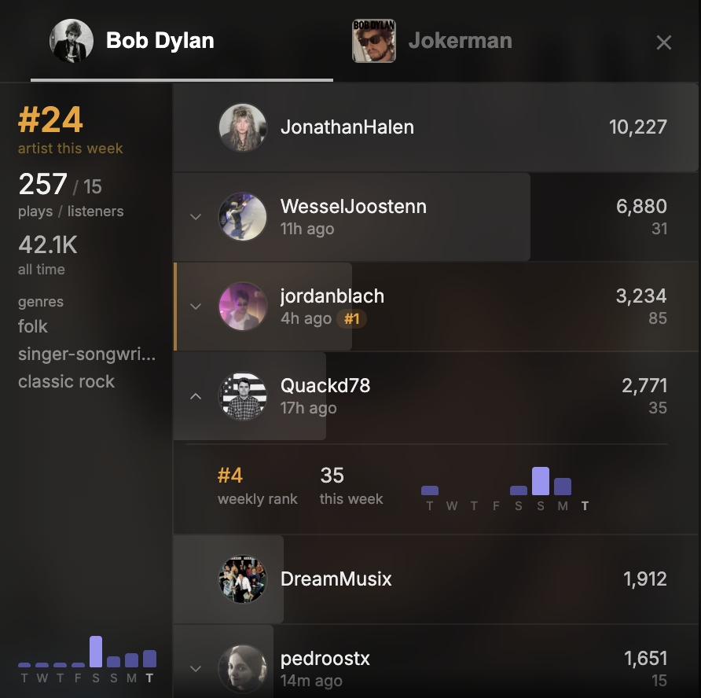
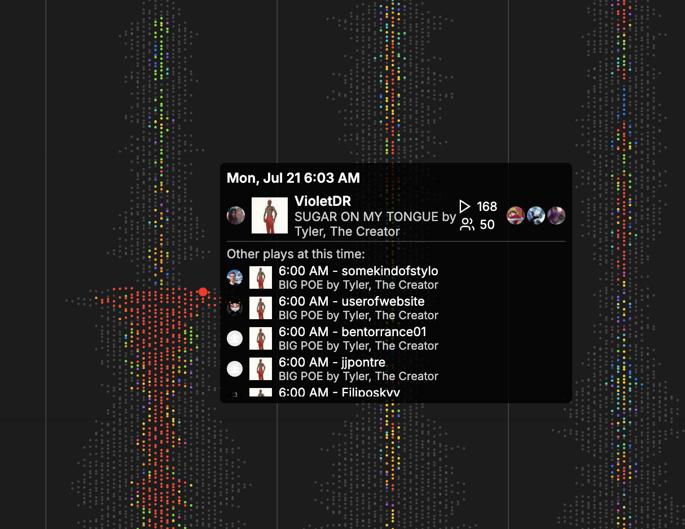
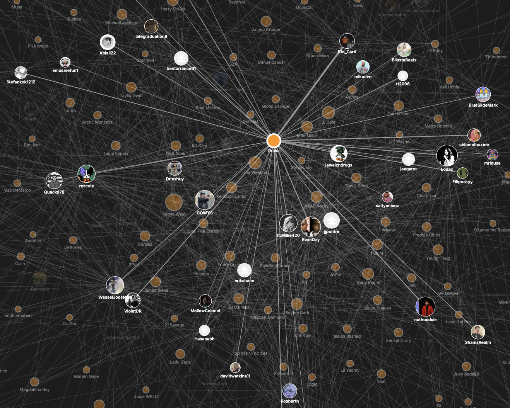
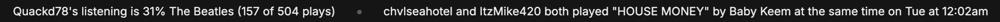

# [lastfmfriends.live](https://lastfmfriends.live)

A real-time dashboard for [Last.fm](https://last.fm) that shows what your friends are listening to and explores weekly listening trends across your whole group. Enter your username and get a live grid of everyone's current track, weekly charts, a scrolling ticker of auto-generated stats, and more, all running entirely in the browser.

## Features

**Live friend grid** — blocks update automatically in the background, sorting now-playing users to the top. Each block shows the current track, artist, and album art, with small indicators for loved tracks, top weekly artists/tracks, and repeat listening. Hovering (desktop) or scrolling to a block (mobile) allows you to "listen in" to what your friend is playing.

**Weekly charts** — top charts are ranked by a score of listener count × capped play count, which prevents a single high-volume listener from dominating. Each entry shows listener avatars and a play button for audio previews, and hovering an avatar shows a tooltip with that person's play count and a sparkline of their daily listening over the past week. Charts include: 

- Top artists/albums/tracks
- Top listeners
- Unique artists/tracks per person
- Longest listening streaks
- Activity by Hour/Day

**Who listens panel** — click the friends icon on any block to see everyone in your group who has played that artist or track. Each listener row shows all-time play counts, weekly plays, last listen time, and a sparkline of their daily plays for the week. A stats panel on the left shows the item's weekly rank, total plays across all listeners, a graph of its share of each day's total group listening, and genre tags. New listeners (discovered this week) and each user's current #1 artist/track are automatically badged.

**Scatter plot** — every play from every friend plotted across a week-by-day grid, color-coded by the top artists. Points are jittered outward in concentric rings when the friend count is large to keep dense periods readable. Hovering a point shows the track, album art, and other friends who were listening at the same time, and automatically scrolls if the list is too long to fit.

Tyler, The Creator's 6am album release visualized
  

**Network graph** — a D3 force-directed graph connecting users to their most-played artists. Users naturally cluster near the artists they've been playing and friends with similar taste, which can show new artists in your circle you haven't heard yet. Node sizes scale to play counts, link widths reflect listening strength, and hovering a node highlights its connections up to two hops out.

**Stats ticker** — a scrolling news-style bar that generates natural headlines from your group's data. It detects things like one listener dominating an artist's plays, two users neck-and-neck on the same album, someone being the sole fan of an artist, identical top-three taste between two friends, synchronous listening moments, peak hours and days, and more.

## How It Works

The app is pure client-side JavaScript. All listening data comes from the Last.fm API. The API is often slow and unreliable, so it uses several strategies to help. It also uses Deezer to fill in the gaps for artist/track images and audio previews, since Last.fm doesn't provide those.

**API reliability** — Last.fm API frequently returns a variety of errors, so it uses retry logic to resubmit fetches. This prevents missing data from users on errors. 

**Caching** — an IndexedDB database caches fetched data to reduce API calls, which reduces time waiting for data. Entries are timestamped so stale data is automatically bypassed on the next fetch.

**Chart data** — all ranking and streak calculations run in a single pass through each user's track history. Four streak buffers (artist, album, track, and listening session) run simultaneously and flush completed streaks as they go. Listening sessions are defined as consecutive plays with gaps of 15 minutes or less. Listening time is estimated by multiplying each track's duration by its play count from the top tracks endpoint, defaulting to 220 seconds when duration data is missing.

**Updates without UI disruption** — when the block grid refreshes, each block is built as a clone rather than modifying the live DOM. Before swapping in the new blocks, the app saves and restores scroll positions inside any open listener panels, hover states, audio preview position, and the full listener panel contents, so nothing resets mid-browse.

**Ticker generation** — each refresh runs 20+ generator functions that evaluate different statistical patterns in the data with tiered conditions and multiple phrasings. The ticker measures the actual rendered pixel width of the generated content and injects an animation rule timed to scroll at exactly 60px/second.

**Cross-API fuzzy matching** — Last.fm track titles rarely map 1:1 with Deezer's database. When searching for a preview or image, it checks for any word overlap in the artist/title rather than requiring an exact match. If that still fails, it strips content in parentheses ("(Remastered)", "(feat. ...)") from the title and tries again.

**Scatter plot rendering** — plays are bucketed into 4-minute time slots. For groups larger than 25 friends, overlapping points in the same bucket are spread outward using a concentric ring offset formula so dense moments stay readable. 

**Sparkline scaling** — bar heights in the various sparklines are scaled using polynomial curves rather than linearly, so a user who has many more plays doesn't completely flatten the bars of someone with fewer plays.

## Getting Started

1. Visit [lastfmfriends.live](https://lastfmfriends.live)
2. Enter your Last.fm username
3. Your dashboard will load, bookmark it for quick access later

Or [try it with my profile](https://lastfmfriends.live/dashboard#ctalbot4).

