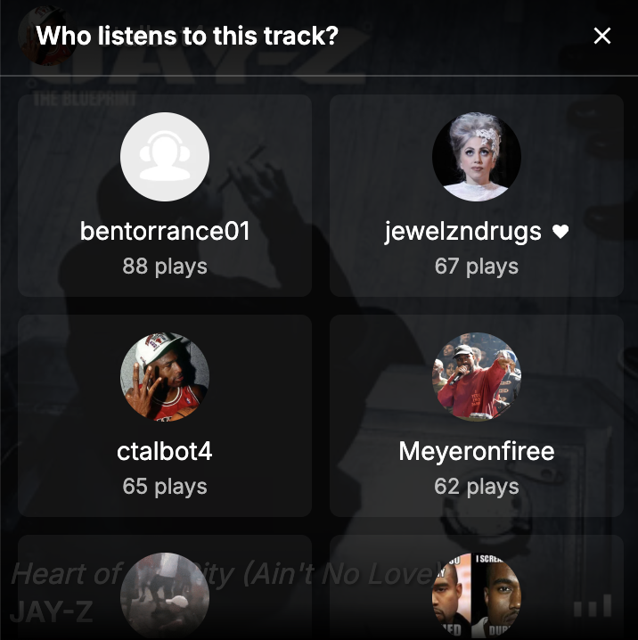

# [lastfmfriends.live](https://lastfmfriends.live)

A real-time dashboard for [Last.fm](last.fm) that lets you see what your friends are currently listening to and discover weekly listening trends. 

  

## Implementation details

### API Integration
- Uses Last.fm API for real-time listening data and friend activity
- Deezer Web API for track previews and artist images
- JSONP implementation to bypass CORS restrictions
- Cloudflare Workers for API key rotation and request distribution

### Performance Optimizations
- Client-side caching system reducing API calls and loading times
- Distributed API key rotation system to avoid rate limits

### Data Processing
- Custom ranking algorithm for friend listening data
- Real-time chart generation and updates
- Bot protection through play count normalization

## Features

### Live Friend Activity
- Real-time updates of your friends' current tracks
- Automatic refresh without page reload
- Visual indicators for now playing status

### Weekly Charts
- Track top artists, albums, and tracks among your friends
- See who the top listeners are for each entry
- Hover to view individual play counts
- Updates in real-time as friends listen

  

### Listen Along
- Preview tracks by hovering over friends' blocks on desktop
- Toggle sound button to enable/disable previews
- Mobile-friendly floating audio button
- Automatic track preview as you scroll on mobile

### Friends Who Listen
- View play counts for each friend per track
- See who has loved each tracks

  

### Trending Ticker
- Real-time overview of trending music
- Stays visible while scrolling

### Anti-Bot Protection
- Prevents single users from dominating charts
- Filters out extreme play counts
- Rankings consider both total plays and number of listeners

## Getting Started

1. Visit [lastfmfriends.live](https://lastfmfriends.live)
2. Enter your Last.fm username
3. Your dashboard will load automatically
4. Bookmark the page for quick access later

  

## Notes

- Supports up to 500 friends
- Rate limiting may occur with too many requests
- Last.fm API availability may affect service

If you experience connection issues, please wait a moment and try again. If problems persist, please report them.
